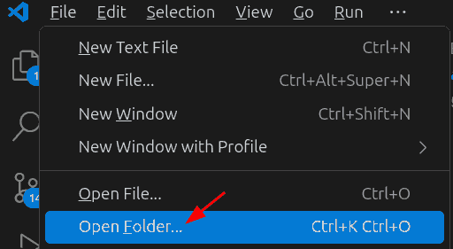
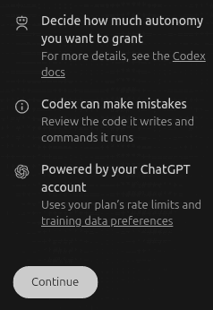

# How to Use Codex with VS Code and LLM Foundry

These are instructions to set up

- [Codex](https://openai.com/codex/)
- on [Visual Studio Code (VS Code)](https://code.visualstudio.com/) using
- in Windows 11
- using [LLM Foundry](https://llmfoundry.straive.com/), Straive's API router.

You don't need admin access or OpenAI API keys.

## 1. Install VS Code

Download [Visual Studio Code](https://code.visualstudio.com/) and install it.

[](https://youtu.be/cu_ykIfBprI)

Then open any folder in VS Code.



## 2. Install Codex

Select the Extensions icon in the sidebar. Search for "Codex" in the search bar and install the one by OpenAI.


**CAREFUL**! There are multiple Codex extensions. You want the [Codex - OpenAI's coding agent](https://marketplace.visualstudio.com/items?itemName=openai.chatgpt).

[](https://youtu.be/qAU-8kM5H2s)

## 3. Log in with a dummy API key

Click on the Codex icon in the sidebar.


This should show 2 buttons:


Click on **Use API Key** and type "ABCD" (or any other random string) in the API key field and click "OK". We will change this later.


Press "Continue" when prompted.



## 4. Configure LLM Foundry

Click on the gear-like settings icon to the right of the Codex pane, then **Codex settings**, then **Open config.toml**.


Paste the following into the `config.toml` file and save it.

```ini
profile = "llmfoundry_azure"
# Alternate profiles:
# profile = "llmfoundry_gemini"
# profile = "llmfoundry_openai"
# profile = "llmfoundry_openrouter"

[profiles.llmfoundry_azure]
model_provider = "llmfoundry_azure"
# NOTE: Azure typically wants the *deployment name* here
model = "gpt-5"

[model_providers.llmfoundry_azure]
name = "LLM Foundry - Azure"
base_url = "https://llmfoundry.straive.com/azure/openai/deployments/gpt-5"
env_key = "LLMFOUNDRY_TOKEN"
wire_api = "chat"
query_params = { api-version = "2025-04-01-preview" }

[profiles.llmfoundry_gemini]
model_provider = "llmfoundry_gemini"
model = "gemini-2.5-flash"

[model_providers.llmfoundry_gemini]
name = "LLM Foundry - Gemini"
base_url = "https://llmfoundry.straive.com/gemini/v1beta/openai"
env_key = "LLMFOUNDRY_TOKEN"
wire_api = "chat"

[profiles.llmfoundry_openai]
model_provider = "llmfoundry_openai"
model = "gpt-5.2-codex"
model_reasoning_effort = "medium"
wire_api = "responses"

[model_providers.llmfoundry_openai]
name = "LLM Foundry - OpenAI"
base_url = "https://llmfoundry.straive.com/openai/v1"
env_key = "LLMFOUNDRY_TOKEN"
wire_api = "responses"

[profiles.llmfoundry_openrouter]
model_provider = "llmfoundry_openrouter"
model = "openai/gpt-5-codex"

[model_providers.llmfoundry_openrouter]
name = "LLM Foundry - Gemini"
base_url = "https://llmfoundry.straive.com/openrouter/v1"
env_key = "LLMFOUNDRY_TOKEN"
wire_api = "chat"

[profiles.openai]
model_provider = "openai"
model = "gpt-5.2-codex"
 # use what your OpenAI account has access to

[model_providers.openai]
name = "OpenAI (Public)"
base_url = "https://api.openai.com/v1"
env_key = "OPENAI_API_KEY" # Set this environment variable to your OpenAI API key
wire_api = "responses"

[profiles.openrouter]
model_provider = "openrouter"
model = "gpt-5.2-codex" # example; pick any OpenRouter model id

[model_providers.openrouter]
name = "OpenRouter (Public)"
base_url = "https://openrouter.ai/api/v1"
env_key = "OPENROUTER_API_KEY" # Set this environment variable to your OpenRouter API key
wire_api = "chat"
```

Any changes to `config.toml` require a restart of VS Code.

<!--

Test this on the CLI using:

codex -p llmfoundry_openai "Hi"
codex -p llmfoundry_azure "Hi"
...

-->

## 5. Set your LLM Foundry API key

Visit [LLM Foundry](https://llmfoundry.straive.com/) and log in with your official Google account.

Then click on the "Code" tab.


Copy the LLM Foundry token.


Search for "Edit environment variables for your account" in the Windows search bar.


Select "New" from the "User variables" section.


Set the variable name to:

`LLMFOUNDRY_TOKEN`

**CAREFULLY**! Copy paste it. Or, if typing:

- Use **upper case** (it's `LLMFOUNDRY` not `llmfoundry`).
- Spell it **correctly** (it's `LLMFOUNDRY` not `LLMFOUNDARY`).
- Don't forget the underscore (it's `LLMFOUNDRY_TOKEN` not `LLMFOUNDRY TOKEN`).

Set the variable value to the token you copied from [LLM Foundry > Code](https://llmfoundry.straive.com/code).

[](https://youtu.be/wbUdbhf7HbI)

## 6. Restart VS Code

Close VS Code.

Then re-open it.

## 7. Verify Codex is working with LLM Foundry

Click on the Codex icon in the sidebar.


Type "Hi" (or anything else) in the prompt box and press Enter.


lf goes well, you should see a response from Codex.


## 8. Troubleshooting

If you see an error like this:


Try the following:

1. Check if [LLM Foundry is up](https://llmfoundry.site24x7statusiq.com/). If not, try later.
2. Check if your `LLMFOUNDRY_TOKEN` environment variable is correct. Re-add it and restart VS Code.

## 8. Try simple examples

You can now use Codex in VS Code with LLM Foundry. Here are a few simple things to try.

1. Copy **text** documents into the folder and prompt Codex to "Summarize these documents".
2. Copy **code** files into the folder and prompt Codex to "Explain this code".
3. Copy **Excel** files into the folder and prompt Codex to "Write code to analyze this data".

## 9. Install Python

Tell Codex to `Install Python and test it. Tell me if it worked`. There's a good chance it'll install it automatically!

Open the Windows search bar and search for "Python". Install any of the Python versions from the Microsoft Store. This will allow Codex to run Python code locally.

[](https://youtu.be/aX4KV5i-cd4)

## 10. Usage tips

To avoid Codex asking for too many approvals, use the "Agent (full access)" mode.


