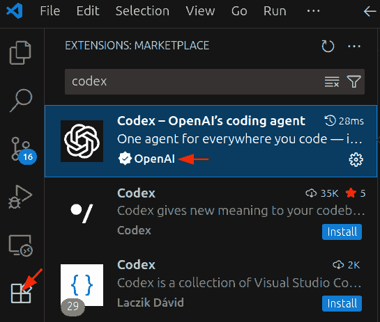
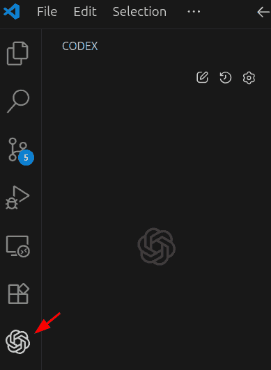
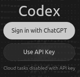
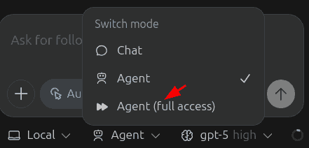

# How to Use Codex with VS Code and ChatGPT paid plans

These are instructions to set up

- [Codex](https://openai.com/codex/)
- on [Visual Studio Code (VS Code)](https://code.visualstudio.com/) using
- in Windows 11
- using a [paid ChatGPT plan](https://chatgpt.com/pricing/)

## 1. Install VS Code

Download [Visual Studio Code](https://code.visualstudio.com/) and install it.

Then open any folder in VS Code.

## 2. Install Codex

Select the Extensions icon in the sidebar. Search for "Codex" in the search bar and install the one by OpenAI.

**CAREFUL**! There are multiple Codex extensions. You want the [Codex - OpenAI's coding agent](https://marketplace.visualstudio.com/items?itemName=openai.chatgpt).

## 3. Log in with a dummy API key

Click on the Codex icon in the sidebar.

This should show 2 buttons:

Click on **Sign in with ChatGPT**, sign into your paid ChatGPT account, and approve the permissions.

Keep clicking "Next" when prompted.

## 4. Verify Codex is working

Click on the Codex icon in the sidebar.

Type "Hi" (or anything else) in the prompt box and press Enter.

lf goes well, you should see a response from Codex.

## 5. Try simple examples

You can now use Codex in VS Code with LLM Foundry. Here are a few simple things to try.

1. Copy **text** documents into the folder and prompt Codex to "Summarize these documents".
2. Copy **code** files into the folder and prompt Codex to "Explain this code".
3. Copy **Excel** files into the folder and prompt Codex to "Write code to analyze this data".

## 6. Install Python

Open the Windows search bar and search for "Python". Install any of the Python versions from the Microsoft Store. This will allow Codex to run Python code locally.

## 7. Usage tips

To avoid Codex asking for too many approvals, use the "Agent (full access)" mode.

