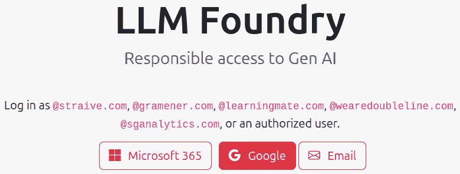
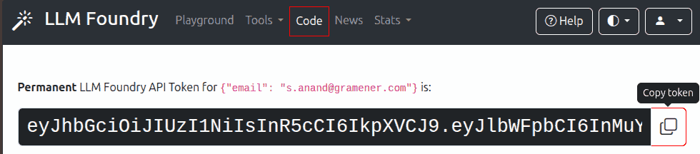
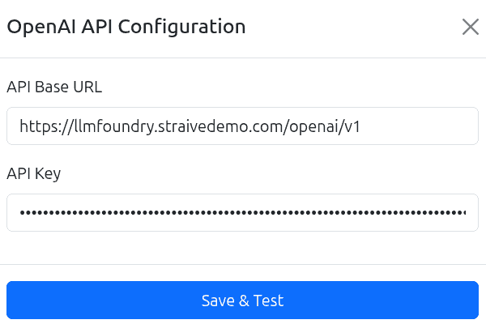

# Using LLM Foundry API keys

These are instructions to applications that support OpenAI-compatible API keys to use LLM Foundry API keys.

**STEP 1**. Visit https://llmfoundry.straive.com/ or https://llmfoundry.straivedemo.com/ and log in with your **work email** by clicking on the "Google" button.

**STEP 2**. Click on the "Code" link in the top navigation bar. Copy the LLM Foundry API token.

**STEP 3**. You may find a "Configure" or "Settings" option in the app. In that, enter:

- **API Base URL**: `https://llmfoundry.straive.com/openai/v1` (or `https://llmfoundry.straivedemo.com/openai/v1`).
- **API Key**: Paste the token you copied in Step 2.

**STEP 4**. Click on **Save & Test**. You may then start using the application.
